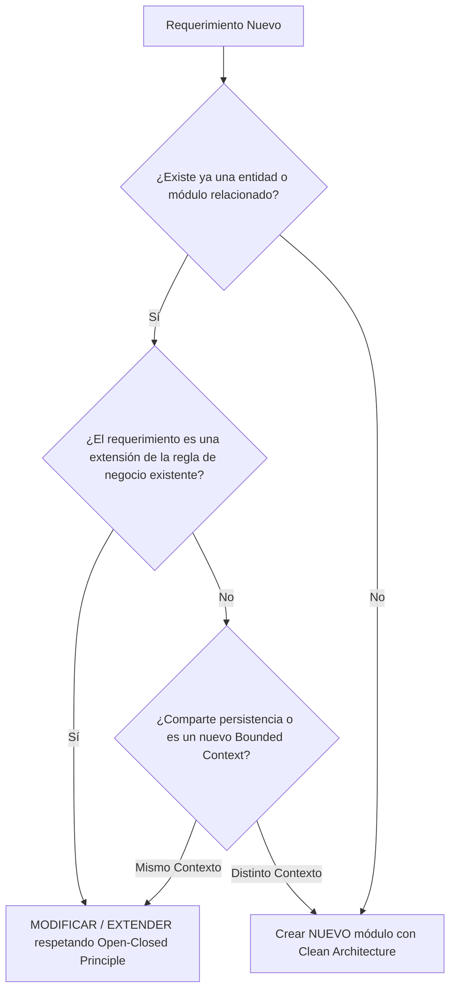

# 🏗️ Flujo de Desarrollo y Estándares de Arquitectura

Este documento establece el **flujo de trabajo obligatorio** y los **estándares de Clean Architecture con TypeORM** para el desarrollo en el repositorio `back-pol-management-tools`.

---

## 🧭 1. Principio Fundamental: Fase de Investigación Previa (MANDATORIO)

> [!IMPORTANT]
> **Antes de escribir cualquier línea de código nuevo**, se debe realizar una investigación exhaustiva en el repositorio para evitar duplicidad de lógica, dispersión de entidades o inconsistencias en la base de datos.

### Checklist de Investigación

| Paso | Acción a Realizar | Herramienta / Ubicación |
| :--- | :--- | :--- |
| **1.1** | **Buscar entidades de dominio u ORM similares** | Revisar `src/modules/**/domain/` y `src/modules/**/infrastructure/persistence/` |
| **1.2** | **Buscar casos de uso o servicios existentes** | Revisar `src/modules/**/application/` |
| **1.3** | **Buscar controladores o endpoints relacionados** | Revisar `src/modules/**/infrastructure/http/` |
| **1.4** | **Revisar dependencias y modelos compartidos** | Revisar `src/core/` y tablas de base de datos |

### Matriz de Decisión: ¿Modificar o Crear Nuevo?



1. **Modificar / Extender cuando:**
   - Se requiere un nuevo campo o método en una entidad ya existente.
   - Se agrega un nuevo caso de uso a un módulo existente (ej. agregar `UpdateUserUseCase` cuando ya existe `CreateUserUseCase`).
   - Se optimiza una consulta o se ajusta una regla de negocio sin romper compatibilidad.
2. **Crear Nuevo cuando:**
   - Corresponde a un dominio o entidad de negocio independiente (ej. `Users`, `Products`, `Orders`, `Auth`).
   - Se crea un subdominio o módulo desacoplado.

---

## 🏛️ 2. Clean Architecture en el Proyecto

El proyecto sigue una estricta separación de responsabilidades en 3 capas concéntricas por cada módulo en `src/modules/<modulo>/`:

```
src/
├── config/                      # Configuración centralizada (DB, Envs, etc.)
├── core/                        # Abstracciones base globales (BaseEntity, IUseCase, IRepository)
└── modules/
    └── <modulo>/
        ├── domain/              # 🧠 CAPA DE DOMINIO (Reglas de negocio puras)
        │   ├── entities/        # Entidades puras (sin decoradores de TypeORM)
        │   ├── value-objects/   # Value Objects inmutables
        │   ├── repositories/    # Interfaces / Puertos de repositorios
        │   └── errors/          # Errores y excepciones del dominio
        ├── application/         # ⚙️ CAPA DE APLICACIÓN (Casos de Uso)
        │   ├── use-cases/       # Casos de uso (Commands / Queries)
        │   ├── dtos/            # DTOs de entrada y salida del caso de uso
        │   └── services/        # Servicios de aplicación
        ├── infrastructure/      # 🔌 CAPA DE INFRAESTRUCTURA (Frameworks & Drivers)
        │   ├── persistence/     # TypeORM (Entidades ORM, Repositorios, Mappers)
        │   │   ├── entities/    # *.orm-entity.ts (Con @Entity, @Column)
        │   │   ├── mappers/     # Conversión entre Domain Entity <-> TypeORM Entity
        │   │   └── repositories/# Implementación del puerto del dominio con TypeORM
        │   └── http/            # Adaptadores HTTP (NestJS)
        │       ├── controllers/ # Controladores (@Controller, @Get, @Post)
        │       └── dtos/        # Request / Response DTOs con class-validator
        └── <modulo>.module.ts   # Módulo NestJS con Inyección de Dependencias
```

### Regla de Dependencia

- **Dominio**: Cero dependencias externas. No importa nada de NestJS ni de TypeORM.
- **Aplicación**: Depende únicamente del Dominio.
- **Infraestructura**: Depende de la Aplicación y del Dominio. Implementa los puertos y adaptadores.

---

## 🛠️ 3. Guía Paso a Paso: Flujo de Implementación de un Módulo

### Paso 1: Capa de Dominio (`domain/`)

1. **Crear la Entidad de Dominio**: Hereda de `BaseEntity` (en `src/core/domain/entity.base.ts`).
2. **Definir el Puerto del Repositorio**: Interfaz que declara qué métodos necesita el dominio.

```typescript
// src/modules/customer/domain/entities/customer.entity.ts
import { BaseEntity } from '../../../../core/domain/entity.base.js';

export interface CustomerProps {
  id?: string;
  name: string;
  email: string;
  isActive?: boolean;
  createdAt?: Date;
  updatedAt?: Date;
}

export class CustomerEntity extends BaseEntity<string> {
  private _name: string;
  private _email: string;
  private _isActive: boolean;

  private constructor(props: CustomerProps) {
    super(props.id ?? crypto.randomUUID(), props.createdAt, props.updatedAt);
    this._name = props.name;
    this._email = props.email;
    this._isActive = props.isActive ?? true;
  }

  public static create(props: CustomerProps): CustomerEntity {
    if (!props.email.includes('@')) {
      throw new Error('Formato de email inválido.');
    }
    return new CustomerEntity(props);
  }

  get name(): string { return this._name; }
  get email(): string { return this._email; }
  get isActive(): boolean { return this._isActive; }

  public deactivate(): void {
    this._isActive = false;
    this.touch();
  }
}
```

```typescript
// src/modules/customer/domain/repositories/customer.repository.interface.ts
import { IRepository } from '../../../../core/domain/repository.interface.js';
import { CustomerEntity } from '../entities/customer.entity.js';

export const CUSTOMER_REPOSITORY_TOKEN = Symbol('CUSTOMER_REPOSITORY_TOKEN');

export interface ICustomerRepository extends IRepository<CustomerEntity, string> {
  findByEmail(email: string): Promise<CustomerEntity | null>;
}
```

---

### Paso 2: Capa de Aplicación (`application/`)

1. **Definir los DTOs de Entrada/Salida del Caso de Uso**.
2. **Implementar el Caso de Uso** implementando `IUseCase`.

```typescript
// src/modules/customer/application/dtos/create-customer.dto.ts
export interface CreateCustomerInput {
  name: string;
  email: string;
}

export interface CustomerOutput {
  id: string;
  name: string;
  email: string;
  isActive: boolean;
  createdAt: Date;
}
```

```typescript
// src/modules/customer/application/use-cases/create-customer.use-case.ts
import { Inject, Injectable } from '@nestjs/common';
import { IUseCase } from '../../../../core/application/use-case.interface.js';
import { CustomerEntity } from '../../domain/entities/customer.entity.js';
import {
  CUSTOMER_REPOSITORY_TOKEN,
  ICustomerRepository,
} from '../../domain/repositories/customer.repository.interface.js';
import { CreateCustomerInput, CustomerOutput } from '../dtos/create-customer.dto.js';

@Injectable()
export class CreateCustomerUseCase implements IUseCase<CreateCustomerInput, CustomerOutput> {
  constructor(
    @Inject(CUSTOMER_REPOSITORY_TOKEN)
    private readonly customerRepository: ICustomerRepository,
  ) {}

  async execute(input: CreateCustomerInput): Promise<CustomerOutput> {
    const existing = await this.customerRepository.findByEmail(input.email);
    if (existing) {
      throw new Error(`El cliente con email ${input.email} ya existe.`);
    }

    const customer = CustomerEntity.create({
      name: input.name,
      email: input.email,
    });

    const saved = await this.customerRepository.save(customer);

    return {
      id: saved.id,
      name: saved.name,
      email: saved.email,
      isActive: saved.isActive,
      createdAt: saved.createdAt,
    };
  }
}
```

---

### Paso 3: Capa de Infraestructura - Persistencia con TypeORM (`infrastructure/persistence/`)

1. **Entidad TypeORM (`*.orm-entity.ts`)**: Define el esquema de la tabla de base de datos.
2. **Mapper (`*.mapper.ts`)**: Transforma bidireccionalmente entre `CustomerEntity` (Dominio) y `CustomerOrmEntity` (TypeORM).
3. **Repositorio TypeORM (`*.typeorm.repository.ts`)**: Implementa la interfaz `ICustomerRepository`.

```typescript
// src/modules/customer/infrastructure/persistence/entities/customer.orm-entity.ts
import { Column, CreateDateColumn, Entity, PrimaryColumn, UpdateDateColumn } from 'typeorm';

@Entity('customers')
export class CustomerOrmEntity {
  @PrimaryColumn('uuid')
  id: string;

  @Column({ type: 'varchar', length: 150 })
  name: string;

  @Column({ type: 'varchar', length: 150, unique: true })
  email: string;

  @Column({ type: 'boolean', default: true })
  isActive: boolean;

  @CreateDateColumn({ type: 'timestamp with time zone' })
  createdAt: Date;

  @UpdateDateColumn({ type: 'timestamp with time zone' })
  updatedAt: Date;
}
```

```typescript
// src/modules/customer/infrastructure/persistence/mappers/customer.mapper.ts
import { CustomerEntity } from '../../../domain/entities/customer.entity.js';
import { CustomerOrmEntity } from '../entities/customer.orm-entity.js';

export class CustomerMapper {
  public static toDomain(orm: CustomerOrmEntity): CustomerEntity {
    return CustomerEntity.create({
      id: orm.id,
      name: orm.name,
      email: orm.email,
      isActive: orm.isActive,
      createdAt: orm.createdAt,
      updatedAt: orm.updatedAt,
    });
  }

  public static toOrm(domain: CustomerEntity): CustomerOrmEntity {
    const orm = new CustomerOrmEntity();
    orm.id = domain.id;
    orm.name = domain.name;
    orm.email = domain.email;
    orm.isActive = domain.isActive;
    orm.createdAt = domain.createdAt;
    orm.updatedAt = domain.updatedAt;
    return orm;
  }
}
```

```typescript
// src/modules/customer/infrastructure/persistence/repositories/customer.typeorm.repository.ts
import { Injectable } from '@nestjs/common';
import { InjectRepository } from '@nestjs/typeorm';
import { Repository } from 'typeorm';
import { CustomerEntity } from '../../../domain/entities/customer.entity.js';
import { ICustomerRepository } from '../../../domain/repositories/customer.repository.interface.js';
import { CustomerOrmEntity } from '../entities/customer.orm-entity.js';
import { CustomerMapper } from '../mappers/customer.mapper.js';

@Injectable()
export class CustomerTypeOrmRepository implements ICustomerRepository {
  constructor(
    @InjectRepository(CustomerOrmEntity)
    private readonly repo: Repository<CustomerOrmEntity>,
  ) {}

  async findById(id: string): Promise<CustomerEntity | null> {
    const found = await this.repo.findOne({ where: { id } });
    return found ? CustomerMapper.toDomain(found) : null;
  }

  async findByEmail(email: string): Promise<CustomerEntity | null> {
    const found = await this.repo.findOne({ where: { email } });
    return found ? CustomerMapper.toDomain(found) : null;
  }

  async findAll(): Promise<CustomerEntity[]> {
    const list = await this.repo.find();
    return list.map(CustomerMapper.toDomain);
  }

  async save(entity: CustomerEntity): Promise<CustomerEntity> {
    const orm = CustomerMapper.toOrm(entity);
    const saved = await this.repo.save(orm);
    return CustomerMapper.toDomain(saved);
  }

  async delete(id: string): Promise<void> {
    await this.repo.delete(id);
  }
}
```

---

### Paso 4: Capa de Infraestructura - HTTP (`infrastructure/http/`)

1. **Request DTO con Validaciones**: Usando `class-validator`.
2. **Controlador NestJS**: Expone los endpoints e invoca los Casos de Uso.

```typescript
// src/modules/customer/infrastructure/http/dtos/create-customer-request.dto.ts
import { IsEmail, IsNotEmpty, IsString, MinLength } from 'class-validator';

export class CreateCustomerRequestDto {
  @IsString()
  @IsNotEmpty()
  @MinLength(3)
  name: string;

  @IsEmail()
  @IsNotEmpty()
  email: string;
}
```

```typescript
// src/modules/customer/infrastructure/http/controllers/customer.controller.ts
import { Body, Controller, Post } from '@nestjs/common';
import { CreateCustomerUseCase } from '../../../application/use-cases/create-customer.use-case.js';
import { CreateCustomerRequestDto } from '../dtos/create-customer-request.dto.js';

@Controller('customers')
export class CustomerController {
  constructor(private readonly createCustomerUseCase: CreateCustomerUseCase) {}

  @Post()
  async create(@Body() dto: CreateCustomerRequestDto) {
    return this.createCustomerUseCase.execute({
      name: dto.name,
      email: dto.email,
    });
  }
}
```

---

### Paso 5: Registro e Inyección en el Módulo (`customer.module.ts`)

```typescript
// src/modules/customer/customer.module.ts
import { Module } from '@nestjs/common';
import { TypeOrmModule } from '@nestjs/typeorm';
import { CUSTOMER_REPOSITORY_TOKEN } from './domain/repositories/customer.repository.interface.js';
import { CreateCustomerUseCase } from './application/use-cases/create-customer.use-case.js';
import { CustomerOrmEntity } from './infrastructure/persistence/entities/customer.orm-entity.js';
import { CustomerTypeOrmRepository } from './infrastructure/persistence/repositories/customer.typeorm.repository.js';
import { CustomerController } from './infrastructure/http/controllers/customer.controller.js';

@Module({
  imports: [TypeOrmModule.forFeature([CustomerOrmEntity])],
  controllers: [CustomerController],
  providers: [
    CreateCustomerUseCase,
    {
      provide: CUSTOMER_REPOSITORY_TOKEN,
      useClass: CustomerTypeOrmRepository,
    },
  ],
  exports: [CreateCustomerUseCase],
})
export class CustomerModule {}
```

---

## ⚙️ 4. Configuración de Base de Datos y TypeORM

1. **Variables de Entorno (`.env`)**:
   - `DB_HOST`, `DB_PORT`, `DB_USERNAME`, `DB_PASSWORD`, `DB_NAME`.
   - `DB_SYNCHRONIZE=true` (solo para desarrollo local).
   - `DB_LOGGING=true`.
2. **Carga Automática de Entidades**:
   - Configurado en `src/config/database.config.ts` con `autoLoadEntities: true`.
   - Cada entidad ORM incluida en `TypeOrmModule.forFeature([Entidad])` dentro de su respectivo módulo se cargará automáticamente.

---

## 📋 Resumen del Flujo para cada Nuevo Desarrollo

1. 🔍 **Investigar**: ¿Existe ya en el repo? ¿Modificar o crear nuevo?
2. 🏷️ **Dominio**: Definir Entidad y Puerto del Repositorio (`domain/`).
3. ⚙️ **Aplicación**: Definir Caso de Uso y DTOs (`application/`).
4. 💾 **TypeORM**: Crear ORM Entity, Mapper y Repositorio (`infrastructure/persistence/`).
5. 🌐 **HTTP**: Crear Request DTO con `class-validator` y Controlador (`infrastructure/http/`).
6. 🔌 **Módulo**: Conectar los proveedores en `<modulo>.module.ts` e importar en `AppModule`.
7. 🧪 **Verificar**: Ejecutar `npm run build` y pruebas.
